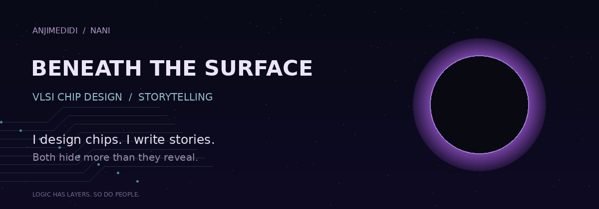
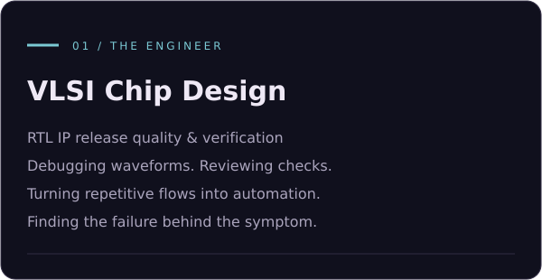
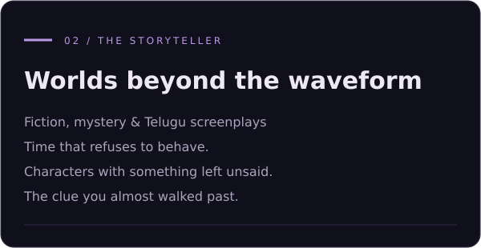

  

  
  
  

<i>The commits tell only half the story.</i>

<table>
<tr>
<td width="50%"></td>
<td width="50%"></td>
</tr>
</table>

<b>VLSI Chip Design Engineer | Automation Builder | Storyteller</b> 
Working with RTL IP, verification, and release automation. Writing fiction beyond the clock.

<!-- Add your verified Email and LinkedIn links here. Coding-platform badges belong here only if you use those accounts. -->

## 🚀 About Me

### 👨‍💻 Who am I?

- 💻 **VLSI Chip Design Engineer** working with RTL IP release quality, verification, and automation.
- 🔍 Interested in simulation debugging, waveforms, assertions, and the checks that help make IP delivery reliable.
- ⚙️ Developing ideas and tools around regression management, release dashboards, and repeatable review flows.
- 🌱 Learning protocols and the wider chip design and verification flow, from RTL to implementation.
- ✍️ **Aspiring writer and artist**, writing fiction and developing Telugu short-film scripts.
- 🌘 Working on **The Twilight**, a story where time, mystery, and lives collide.

> I design chips. I write stories. Both hide more than they reveal.

<!-- Optional education line: add your actual degree, college, and graduation year. -->

## ⚡ Tech Stack & Engineering Arsenal

<table>
<tr>
<td width="50%" valign="top">
<h3>💻 Languages & scripting</h3>

<code>Python</code> <code>Shell scripting</code>

<h3>🔬 Simulation & debugging</h3>

Xcelium · SimVision · VCS Waveforms · Assertion failures · Testbench debug

<h3>🧭 Static checks</h3>

JasperGold Superlint · JasperGold CDC Lint review · CDC review

<h3>⚙️ Synthesis & equivalence</h3>

Genus · Conformal · Vivado Synthesis review · LEC review · Timing debug

</td>
<td width="50%" valign="top">
<h3>🛠️ Development tools</h3>

Linux · Git · SVN · PyQt5 · ReportLab

<h3>📦 IP delivery</h3>

Release checks · Report review · Release notes Documentation checks · Peer review workflows

<h3>🤖 AI & automation interests</h3>

AI assistants · Document RAG · Review agents Workflow automation · Automated reporting

<h3>✍️ Creative toolkit</h3>

Fiction · Screenwriting · Worldbuilding Character development · Telugu dialogue

</td>
</tr>
</table>

## 🌱 Currently Exploring

**Protocols:** PCIe · AXI / AXI-Lite · APB · CXL · USB · Ethernet · SerDes · UCIe

**Design flow:** RTL · SystemVerilog / UVM verification · CDC / RDC · X-prop · Synthesis · STA · LEC · Physical design · DFT / ATPG · IP-XACT

**Automation:** Regression dashboards · Review agents · Document-based assistants · CLI workflows

These are learning interests; the workbench above describes tools and areas I've worked with.

## 💼 Projects & Work in Progress

The following are projects and ideas I'm developing. Public repository links will be added as they become available.

<table>
<tr>
<td width="50%" valign="top">
<h3>📊 Release Dashboard</h3>

A dashboard concept for upcoming IP releases, check status, and review progress.

<code>Release tracking</code> <code>Automation</code>

<ul><li>Bring release information into one view</li><li>Make pending checks and ownership easier to follow</li></ul>
</td>
<td width="50%" valign="top">
<h3>🧪 Regression Manager</h3>

A desktop tool project for viewing test status, logs, results, and failures.

<code>Python</code> <code>PyQt5</code> <code>Debugging</code>

<ul><li>Navigate regression results</li><li>Connect failures with their logs</li></ul>
</td>
</tr>
<tr>
<td width="50%" valign="top">
<h3>🕵️ Peer Review Agent</h3>

A workflow concept that brings reports, checklists, and reviewer progress together.

<code>Review automation</code> <code>Checklists</code>

<ul><li>Track report inputs and review status</li><li>Handle requests for missing information</li></ul>
</td>
<td width="50%" valign="top">
<h3>📚 Document Assistant</h3>

A RAG assistant concept for finding answers in technical documentation and supporting automation work.

<code>RAG</code> <code>Documents</code> <code>AI assistants</code>

<ul><li>Retrieve relevant document passages</li><li>Explore documentation-driven scripting</li></ul>
</td>
</tr>
<tr>
<td width="50%" valign="top">
<h3>🌘 The Twilight</h3>

A novel in progress combining time displacement, romance, and mystery.

<code>Fiction</code> <code>Mystery</code> <code>Worldbuilding</code>

<i>Some people arrive in a life they were never meant to enter.</i>

</td>
<td width="50%" valign="top">
<h3>🎬 Telugu Short Films</h3>

Developing stories such as Roommates (101) and Break-Up Flat, built around everyday conversations and relationships.

<code>Screenwriting</code> <code>Telugu</code> <code>Dialogue</code>

<i>Small rooms. Complicated people. Plenty left unsaid.</i>

</td>
</tr>
</table>

## 🚀 Engineering Experience

My work focuses on RTL IP release quality and the verification and review activities around delivery.

<table>
<tr>
<td width="33%" valign="top">
<h3>🔍 Verification & debug</h3>
<ul><li>Simulation result review</li><li>Waveform investigation</li><li>Assertion failure analysis</li><li>Testbench failure debug</li><li>Performance test review</li></ul>
</td>
<td width="33%" valign="top">
<h3>📦 Release quality</h3>
<ul><li>Lint and CDC report review</li><li>Synthesis and LEC status review</li><li>Release notes</li><li>Documentation review</li><li>Delivery checklists</li></ul>
</td>
<td width="34%" valign="top">
<h3>⚙️ Automation</h3>
<ul><li>Shell and Python scripting</li><li>CLI workflow tools</li><li>Report generation</li><li>Desktop GUI tooling</li><li>Release and regression tooling</li></ul>
</td>
</tr>
</table>

## 🏅 Achievements

<!-- Replace this section with your real achievements. Examples: an award, shipped public tool, accepted contribution, certification, or measurable improvement. Do not publish the reference profile's achievements as your own. -->

*This section is waiting for a few milestones worth sharing.*

## 🏆 Work & Creative Highlights

- Bringing **chip design, verification, and automation** into the same workflow.
- Exploring tools that make **IP release checks and regression results** easier to manage.
- Learning protocols through their connection to practical design and verification.
- Developing a novel and Telugu screenplays alongside engineering work.

<!-- Add verified numbers here when available: time saved, public contributions, completed projects, releases supported, or published writing. -->

## 📈 GitHub Analytics & Open Source Activity

## 🌐 Find Me

<a href="https://github.com/anjimedidi">GitHub</a> · <a href="https://github.com/anjimedidi?tab=repositories">Repositories</a> · <a href="https://github.com/anjimedidi?tab=stars">Things that caught my eye</a>

<!-- Add Email, LinkedIn, portfolio, and writing links once you've supplied the correct URLs. -->

---

<i>The commits tell only half the story.</i> LOOK CLOSER. THE IMPORTANT PART IS USUALLY QUIET.

